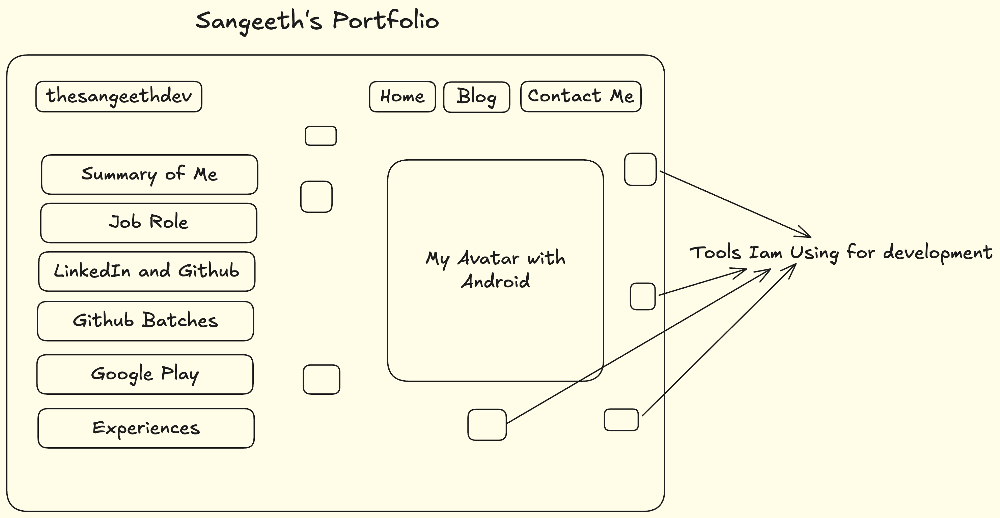

# Eve's Gifts

Building by - Sangeeth Amirthanathan

**Sangeeth's Portfolio** is a portfolio web app implemented by using Kotlin Multiplatform Web 

Time spent: TBA - building in progress

## UIs Implementations

UI | Home Page | Blogs |
--- |-----------|-----|
Images | TBA | TBA |

## Functionalities

**Required** functionalities:

TBA

The following **extensions** need to be implemented:

TBA

## Video walkthrough for potrait

TAB

## Video walkthrough for session time out

TBA

## Video walkthrough for landscape

TBA

## Image Walkthrough

Here's a walkthrough of implemented user stories:

<table>
  <tr>
    <th>Screen</th>
    <th>App View</th>
    <th>Sign In View</th>
    <th>Home View</th>
    <th>Location View</th>
    <th>Setting View</th>
    <th>Session Timeout</th>
  </tr>
  <tr>
    <td>Images</td>
    <td>TBA</td>
    <td>TBA</td>
    <td>TBA</td>
    <td>TBA</td>
    <td>TBA</td>
    <td>TBA</td>
  </tr>
</table>

# Screenshots Tablet
Screen | Landscape |
--- |-------------------|
Images | TBA               |

## Workflow Diagram

## License

    Copyright 2026 Sangeeth Amirthanathan, Sangeeth's Portfolio App

    Licensed under the Apache License, Version 2.0 (the "License");
    you may not use this file except in compliance with the License.
    You may obtain a copy of the License at

        http://www.apache.org/licenses/LICENSE-2.0

    Unless required by applicable law or agreed to in writing, software
    distributed under the License is distributed on an "AS IS" BASIS,
    WITHOUT WARRANTIES OR CONDITIONS OF ANY KIND, either express or implied.
    See the License for the specific language governing permissions and
    limitations under the License.

